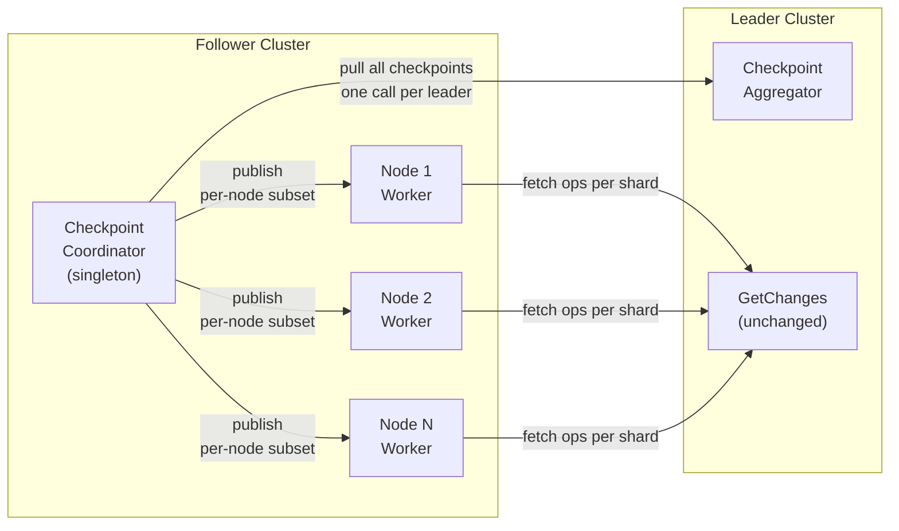
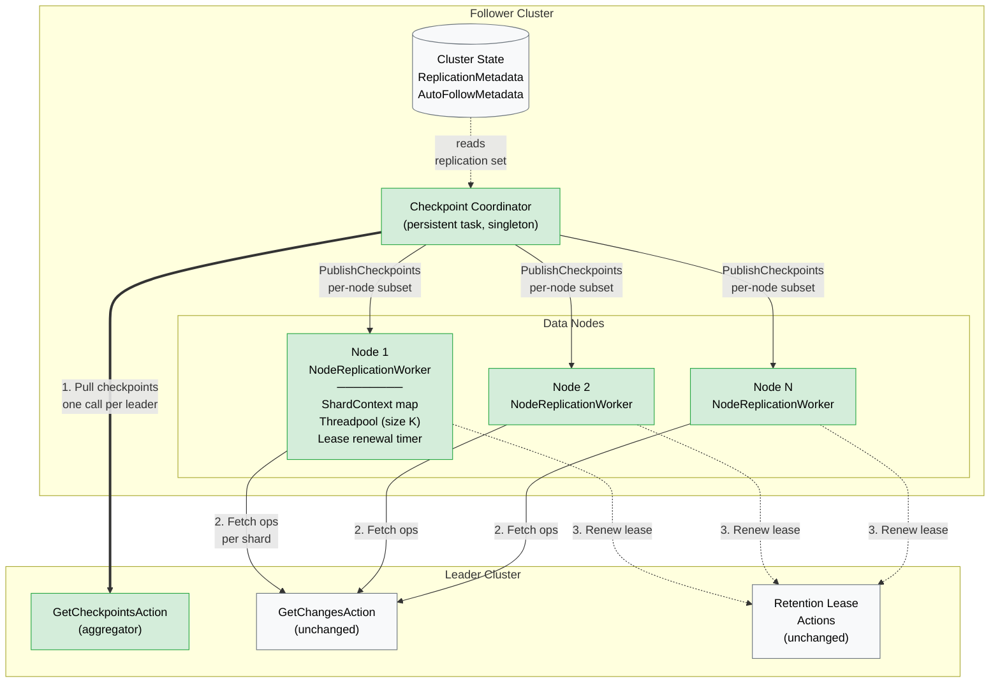
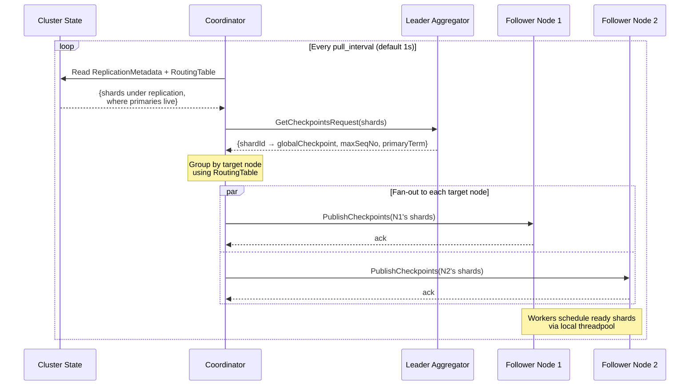
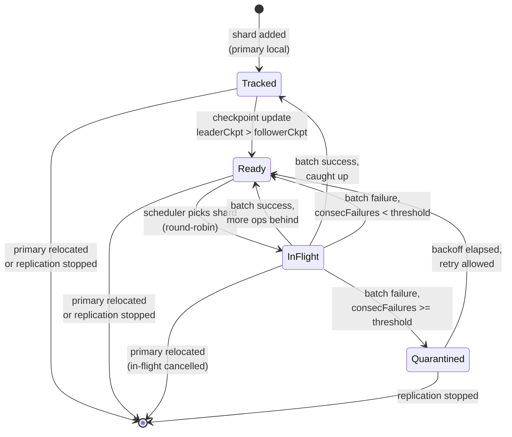
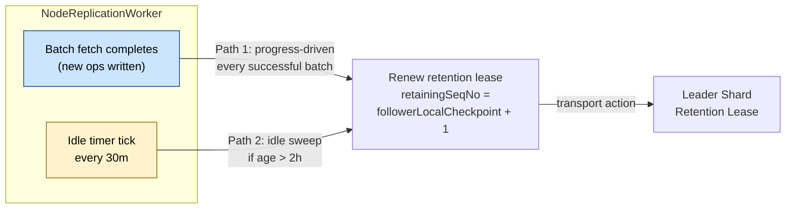
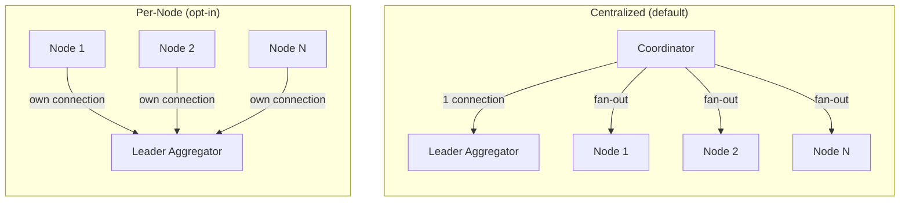

# Design: Checkpoint Coordination Protocol for CCR

**Status:** Draft
**Author:** Ankit Jain
**Date:** 2026-05-07
**Target:** OpenSearch Cross-Cluster Replication

---

## TL;DR

**What we're changing:** Replace per-shard persistent tasks with a cluster-level *Checkpoint Coordinator* and per-node *Replication Workers*. Leader exposes an aggregated checkpoint pull API. Retention lease renewal is decoupled from the fetch loop via an independent timer.

**Why:** Current design creates O(shards) persistent tasks, so every autofollow match, pause, resume, or stop triggers proportional cluster state churn. At scale (10k+ shards), this is the dominant operational pain point.

**How it works at 30,000 feet:**



**Key properties:**

| Dimension | Before | After |
|---|---|---|
| Persistent tasks | 1 per index + 1 per shard | 1 per follower cluster |
| Cluster state updates on start/stop | O(shards) | O(1) |
| Leader connections per follower | O(shards) | 1 (default) or O(nodes) (opt-in) |
| Lease renewal cadence | Coupled to poll loop | Progress-driven + idle timer |
| Autofollow cost | N persistent tasks | 1 metadata update |

**Topology:** Centralized coordinator is the default. A cluster setting flips to per-node mode for high-shard/low-node deployments. Data-node side is identical in both modes.

**What doesn't change:** `GetChangesAction` fetch protocol, retention lease semantics, bootstrap flow (snapshot/restore), active-passive model, existing REST APIs.

**Biggest risks:** Coordinator failover window (mitigated: self-healing within one pull tick), idle-lease expiry (mitigated: independent 30m renewal timer), loss of per-shard task visibility (mitigated: replacement status API, separate design).

---

## 1. Problem Statement

The current CCR implementation creates one `IndexReplicationTask` per replicated index and one `ShardReplicationTask` per follower primary shard, all registered as OpenSearch persistent tasks. This design has three significant limitations:

1. **Cluster state churn.** Each task registration/deregistration mutates cluster state. Adding or removing replication on many indices (especially via autofollow matching hundreds of indices) causes a proportional number of cluster state updates, each serialized through the cluster manager. This is the dominant pain point at scale.

2. **Per-shard polling overhead.** Every follower primary independently long-polls its leader shard. At high shard counts, the leader sees N long-polling connections per follower cluster — mostly idle, but each holding transport resources.

3. **Idle shards still hold translog.** Today, lease renewal is coupled to the shard's replication loop. If no new data is arriving, the lease is still renewed each poll-timeout cycle. This works, but ties lease lifecycle to polling cadence rather than treating it as an independent concern.

The goals of this redesign are:

- Eliminate per-shard persistent tasks and their cluster state cost.
- Decouple checkpoint discovery from per-shard fetch loops.
- Keep the existing replication correctness guarantees: ordered replay, retention lease integrity, no data loss.
- Preserve target replication lag of a few seconds.

---

## 2. Non-Goals

- Changing the data-fetch protocol itself (`GetChangesAction` and translog-based fetch remain).
- Changing retention lease semantics — they still preserve operations `>= retainingSequenceNumber`.
- Changing the bootstrap flow (snapshot/restore).
- Supporting active-active replication.

---

## 3. Proposed Design

### 3.1 High-Level Architecture

Replace per-shard persistent tasks with:

1. **Checkpoint Coordinator** — a cluster-level singleton (persistent task) on the follower cluster that pulls leader checkpoint information and distributes it to data nodes.
2. **Node-Level Replication Worker** — one per data node, consumes checkpoint updates, schedules fetch work for local follower primaries via a configurable threadpool.
3. **Leader-Side Checkpoint Aggregator** — a transport action on the leader cluster that returns current checkpoints for a requested set of shards in a single call.



*Green: new components. Grey: existing components, unchanged.*

### 3.2 What Moves Out of Cluster State

**Removed:**
- `ShardReplicationTask` persistent tasks (per-shard)
- `IndexReplicationTask` persistent tasks (per-index)

**Retained in cluster state (unchanged):**
- `ReplicationMetadata` — which indices are being replicated, leader alias, settings, pause state.
- `AutoFollowMetadata` — autofollow rules.
- The `CheckpointCoordinator` persistent task definition itself (one entry, not one per index).

**In memory only (rebuilt on coordinator failover or node restart):**
- Current leader checkpoints per shard.
- `lastLeaseRenewalMillis` per shard.
- In-flight batch ranges and backoff state.
- `TranslogSequencer` buffers.

---

## 4. Component Design

### 4.1 Checkpoint Coordinator

**Topology:** Cluster-level persistent task, singleton per follower cluster. Runs on a node with the `remote_cluster_client` role (not the cluster manager). Relies on the persistent task framework for failover.

**Responsibilities:**

1. Read `ReplicationMetadata` from cluster state → determine the set of (leader alias, leader index, follower index) tuples under replication.
2. Resolve the set of shards to track using the follower cluster's `RoutingTable`.
3. On each tick (configurable, default 1s), for each leader connection:
   - Batch all shards under that leader into a single `GetCheckpointsRequest`.
   - Receive `GetCheckpointsResponse` with current `lastSyncedGlobalCheckpoint` for each shard.
4. Group results by target follower node (via `RoutingTable` lookup of follower primary).
5. Fan out one `PublishCheckpointsRequest` per target node with only that node's subset.

**Failure handling:**
- If a leader call fails, retry with backoff; other leaders are unaffected.
- If a target node fan-out fails, log and retry on next tick — checkpoints are idempotent.
- On coordinator failover, the new instance starts cold and rebuilds state in one tick. Data nodes serve stale checkpoints (up to one tick old) during the gap, which is acceptable.

**One pull cycle:**



### 4.2 Leader-Side Checkpoint Aggregator

**Transport action:** `indices:data/read/plugins/replication/checkpoints`

**Request:**
```
GetCheckpointsRequest {
    shards: List<ShardId>
}
```

**Response:**
```
GetCheckpointsResponse {
    checkpoints: Map<ShardId, ShardCheckpoint>
}

ShardCheckpoint {
    globalCheckpoint: Long
    maxSeqNo: Long
    primaryTerm: Long
}
```

**Implementation:** Fan out internally on the leader cluster to each shard's primary node, aggregate, return. Standard node-level fan-out pattern (similar to `_nodes/stats`). No persistence — pulls live values from `IndexShard`.

**Security:** Same permission model as existing `GetChangesAction`. No new index-level permissions required.

### 4.3 Node-Level Replication Worker

**Lifecycle:** Started on plugin initialization on every data node. Not a persistent task — lives for the lifetime of the node.

**State (in memory):**
```
ConcurrentHashMap<ShardId, ShardReplicationContext>

ShardReplicationContext {
    leaderShardId: ShardId
    leaderAlias: String
    observedLeaderCheckpoint: Long      // most recent from coordinator
    followerLocalCheckpoint: Long       // from IndexShard
    lastLeaseRenewalMillis: Long
    consecutiveFailures: Int            // for circuit breaker
    quarantinedUntil: Long              // 0 if healthy
    changesTracker: ShardReplicationChangesTracker
    sequencer: TranslogSequencer
    backoffMillis: Long
}
```

**Inputs:**
- `PublishCheckpointsAction` from coordinator — updates `observedLeaderCheckpoint`.
- Cluster state changes — adds/removes shards from the tracked set as primaries relocate or replication starts/stops.
- Internal lease-renewal timer (see 4.4).

**Work scheduling:**
- Fixed-size threadpool (configurable, default 32 per node).
- On checkpoint update, shards where `observedLeaderCheckpoint > followerLocalCheckpoint` are marked ready.
- Scheduler picks ready shards **round-robin**, not FIFO — prevents one backlogged shard from monopolizing workers.
- At most one in-flight batch per shard — a shard never occupies multiple workers simultaneously.

**Circuit breaker:**
- After N consecutive `GetChangesAction` failures for a shard (configurable, default 10), mark it quarantined for a backoff duration (exponential, capped at 10 minutes).
- Quarantined shards do not get scheduled until `quarantinedUntil` elapses.
- Surface quarantine state via a status API for operator visibility.

**Shard context state machine:**



Quarantined is a sticky state that requires the backoff timer to elapse before re-entry. Operators can observe quarantined shards via the status API and investigate root cause.

### 4.4 Retention Lease Renewal (Including Idle Shards)

This is the key correctness-sensitive component.

**Two renewal paths:**

1. **Progress-driven renewal** (existing behavior preserved).
   After a successful batch write on the follower, renew the lease with `followerLocalCheckpoint + 1`. This is the common case and advances the retainingSeqNo as replication progresses.

2. **Idle-shard renewal (new).**
   An independent timer runs on each node-level worker, every 30 minutes (configurable). For each tracked shard, if `now - lastLeaseRenewalMillis > leaseRenewalThreshold` (default 2 hours), renew the lease with the current `followerLocalCheckpoint + 1` regardless of whether there is new data.

   The threshold of 2h well under the OpenSearch default lease expiry of 12h provides margin for:
   - Transient leader connectivity failures
   - Node restart windows
   - Coordinator failover gaps

**On coordinator failover / node restart:**
- New worker starts with `lastLeaseRenewalMillis = 0` for all shards.
- The first idle-renewal tick renews all leases regardless of age. Self-healing, no cluster state involvement.

**On primary relocation (follower side):**
- Old node removes the shard from its map — it no longer hosts the primary.
- New node adds the shard and will run its first idle-renewal within 30 minutes. This is safe because the lease on the leader is still valid (no one removed it), just not being renewed by the new node yet.

**Two renewal paths, visualized:**



Path 1 (blue) handles busy shards. Path 2 (yellow) handles idle shards whose lease would otherwise expire. Both converge on the same renewal call — idempotent, safe to run concurrently.

### 4.5 Shard Relocation and Replication Metadata Changes

**On cluster state change**, the node-level worker:
1. Enumerates local follower primaries from the updated `RoutingTable`.
2. Computes `additions = localPrimaries - trackedShards` and `removals = trackedShards - localPrimaries`.
3. For additions, creates a fresh `ShardReplicationContext` seeded from `IndexShard` state.
4. For removals, cancels any in-flight work and removes the entry.

**Idempotency requirement:** `GetChangesAction` is idempotent over the same seqNo range (translog operations are deterministic). If a shard briefly runs on two nodes during relocation, the overlap is wasteful but not incorrect.

### 4.6 Pause and Stop Semantics

**Pause (`_pause` API):**
1. Update `ReplicationMetadata` in cluster state to mark the index paused.
2. On cluster state propagation, each node worker removes the index's shards from its scheduled set.
3. In-flight batches are allowed to complete (to avoid torn writes). No new batches are enqueued.
4. Retention leases on the leader are preserved during pause — replication can resume without re-bootstrap.

**Stop (`_stop` API):**
1. Update `ReplicationMetadata` to mark replication stopped.
2. Each node worker removes the index's shards and cancels in-flight batches.
3. Coordinator removes retention leases from the leader (best-effort).
4. Follower index block is removed, making it writable.

Stop returns after step 1 completes (metadata update acknowledged). Cleanup is asynchronous.

### 4.7 Throttling Controls

Throttling has two distinct concerns — protecting the follower node from over-committing local resources, and protecting the leader from aggressive followers. Both sides need independent controls, and follower-side controls must be keyed on leader alias so a slow leader does not stall replication from a healthy one.

**Follower-side throttling (cluster settings on the follower cluster):**

| Concern | Mechanism |
|---|---|
| Worker pool bound | Fixed threadpool size (see 4.3) |
| Concurrent batches per shard | Semaphore per shard context, default 1 |
| Concurrent batches per leader connection | Semaphore per leader alias, default 16 |
| In-memory sequencer buffer | Max buffered bytes per shard; blocks readers when exceeded |
| Bytes/sec ingest rate per node | Token-bucket rate limiter, default unlimited |
| Per-index override | Index setting `index.plugins.replication.max_concurrent_batches` |

Per-leader-alias semaphore is the key isolation primitive. If leader A is slow or returning 429s, readers for shards under leader A block on the semaphore, while leader B readers proceed unimpeded.

**Leader-side throttling (cluster settings on the leader cluster):**

| Concern | Mechanism |
|---|---|
| Concurrent `GetChangesAction` per shard | Semaphore in `TransportGetChangesAction`, default 4 |
| Concurrent checkpoint pulls per connection | Semaphore in `GetCheckpointsAction`, default unlimited |
| Max bytes/sec served per follower connection | Token-bucket keyed on transport connection |

When any limit is exceeded, the leader returns `TOO_MANY_REQUESTS` (429). Followers honor this with exponential backoff — see the existing handling in `ShardReplicationTask.kt:272-283` which is preserved.

**Dynamic vs. static settings:**

All rate-limit and semaphore-size settings must be **dynamic** (`Scope.DYNAMIC`) — operational values are learned in production, not at plugin init. Threadpool size remains static (OpenSearch threadpools don't resize), but the effective parallelism cap is set by the dynamic semaphore, not the thread count. Workers exist in the pool; how many can hold work at once is tunable.

**Precedence:**

Cluster setting applies to all replicated indices on that cluster. Index setting (where supported) overrides cluster setting for a specific index. No merge semantics — index setting is absolute when present.

---

## 5. Topology Choice: Centralized vs. Per-Node

The centralized coordinator design is the default. A configuration option (cluster setting) allows switching to per-node mode where each data node pulls checkpoints for its own shards directly from the leader.

**Default (centralized) rationale:**
- Single connection per leader from the follower cluster.
- Aggregated pull call is cheaper for the leader.
- Works well for the common case of many nodes, moderate shards.

**Per-node mode rationale:**
- Better for high-shard, low-node deployments (high shards-per-node).
- No coordinator failover window for checkpoint freshness.
- Uniform node behavior, no asymmetry.

**Crossover heuristic:** Rough guideline — if average shards per node < 5, centralized is better; if > 50, per-node is better. This should be validated with benchmarks (see Section 8).

**Data-node-side implementation is identical in both modes.** The only difference is who sends `PublishCheckpointsRequest`: the coordinator (centralized) or a local sub-task per node (per-node).



**Trade-off summary:**

| Dimension | Centralized | Per-Node |
|---|---|---|
| Connections to leader | 1 per follower cluster | 1 per follower node with replicated primaries |
| Failover window | One pull tick (stale checkpoints) | None — no singleton |
| Coordinator heap | Holds all checkpoints | Each node holds own subset |
| Wins when | Many nodes, few shards per node | Few nodes, many shards per node |

---

## 6. API Changes

### 6.1 New Transport Actions

| Action | Direction | Purpose |
|---|---|---|
| `indices:data/read/plugins/replication/checkpoints` | Follower → Leader | Aggregated checkpoint pull |
| `internal:plugins/replication/checkpoints/publish` | Coordinator → Data nodes | Fan-out distribution |

### 6.2 New Cluster Settings

| Setting | Default | Purpose |
|---|---|---|
| `plugins.replication.coordinator.topology` | `centralized` | `centralized` or `per_node` |
| `plugins.replication.coordinator.pull_interval` | `1s` | How often to pull checkpoints |
| `plugins.replication.worker.threadpool_size` | `32` | Per-node worker pool size |
| `plugins.replication.worker.idle_lease_renewal_interval` | `30m` | Idle-shard lease renewal sweep |
| `plugins.replication.worker.lease_renewal_threshold` | `2h` | Max age before forced renewal |
| `plugins.replication.worker.circuit_breaker_threshold` | `10` | Consecutive failures before quarantine |
| `plugins.replication.follower.max_concurrent_batches_per_shard` | `1` | Follower: in-flight batches per shard |
| `plugins.replication.follower.max_concurrent_batches_per_leader` | `16` | Follower: in-flight batches per leader alias |
| `plugins.replication.follower.max_buffered_bytes_per_shard` | `64mb` | Follower: sequencer buffer cap per shard |
| `plugins.replication.follower.max_bytes_per_sec_per_node` | `unlimited` | Follower: ingest rate cap per node |
| `plugins.replication.leader.max_concurrent_get_changes_per_shard` | `4` | Leader: concurrent fetch per shard |
| `plugins.replication.leader.max_concurrent_checkpoint_pulls` | `unlimited` | Leader: concurrent checkpoint pulls |
| `plugins.replication.leader.max_bytes_per_sec_per_connection` | `unlimited` | Leader: bytes served per follower connection |

All throttling settings are `Scope.DYNAMIC` and updatable at runtime via `_cluster/settings`.

### 6.3 REST APIs

No changes to existing start/stop/autofollow/status APIs. The status API internals change to read from node-level worker state instead of persistent tasks.

---

## 7. Migration and Compatibility

**Breaking change for upgrade path.** The existing persistent-task-based implementation cannot coexist with the new model within a cluster.

**Upgrade procedure:**
1. Pause all replication (`_pause` API per index).
2. Upgrade all nodes on the follower cluster to the new version.
3. Existing `ShardReplicationTask` and `IndexReplicationTask` persistent tasks are removed during plugin initialization (one-time cluster state cleanup).
4. Resume replication. The new coordinator picks up from `ReplicationMetadata` and rebuilds state.

**No leader-side upgrade required for correctness** — the new transport action is additive. Older leaders without the aggregator still work via the existing per-shard `GetChangesAction` path (fallback mode to be implemented if mixed-version support is needed).

---

## 8. Open Questions

1. **Benchmarking targets.** What deployment shapes should be measured before final topology default is chosen? Suggested: (a) 100 shards / 200 nodes, (b) 10k shards / 20 nodes, (c) 10k shards / 200 nodes. Measure leader CPU, coordinator heap, replication lag, and cluster state update rate for both modes.

2. **Multi-leader topology.** Should the centralized coordinator be one-per-cluster or one-per-leader-connection? One-per-leader localizes failures but increases persistent task count. One-per-cluster is simpler. **Initial recommendation: one-per-cluster for v1.**

3. **Backpressure from leader.** If the leader is overloaded, how does it signal the coordinator to slow down? Current `GetChangesAction` returns `TOO_MANY_REQUESTS`. Should checkpoint pulls honor a similar signal? **Initial recommendation: yes, coordinator backs off on 429 from the leader.**

4. **Status API redesign.** `_cat/tasks?actions=*replication*` will no longer show per-shard tasks. A replacement is needed to surface per-shard context state (checkpoint lag, circuit breaker state, last lease renewal). **Needs separate design.**

5. **Persistent task allocation for coordinator.** The persistent task framework picks "the node with the fewest tasks" by default. For the coordinator, we want a node with `remote_cluster_client` role and reasonable headroom. Does the framework support a predicate, or do we need a custom executor? **To investigate.**

6. **Mixed-version clusters during rolling upgrade.** Between steps 2 and 3 above, some follower nodes are upgraded and some are not. The coordinator shouldn't start until all nodes are on the new version. **Gate on a feature flag in cluster state.**

7. **Leader-side throttling primitive.** Should the leader throttle on (a) concurrent `GetChangesAction` calls per shard, (b) bytes/sec per follower connection, or (c) some combination? Each has different operator ergonomics and different protection characteristics. Needs benchmarking to pick defaults. **Initial recommendation: ship both per-shard concurrency and per-connection bytes/sec, default the concurrency one to a sane value and leave bytes/sec unlimited until we have data.**

---

## 9. Risks and Mitigations

| Risk | Impact | Mitigation |
|---|---|---|
| Coordinator becomes a bottleneck at extreme scale | Replication lag spikes | Per-node topology as escape hatch; benchmark before GA |
| Idle-lease-renewal timer fails silently | Lease expires → replication breaks | Surface last-renewal-age in status API; alert if > threshold |
| Circuit breaker quarantines a shard operators don't notice | Silent replication stall for one shard | Status API exposes quarantine state; log at WARN |
| In-memory state lost on node restart | Replication stalls for a tick until coordinator republishes | Acceptable — designed for this, self-heals within pull_interval |
| Coordinator assigned to a node without `remote_cluster_client` role | Coordinator cannot pull from leader | Custom allocation predicate; fail assignment if no eligible node |

---

## 10. Appendix

### A. Comparison to Current Design

| Dimension | Current | Proposed |
|---|---|---|
| Persistent tasks | 1 per index + 1 per shard | 1 per cluster (coordinator) |
| Cluster state updates on start replication | O(shards) | O(1) |
| Leader connections per follower | O(shards) | 1 (centralized) or O(nodes) (per-node) |
| Checkpoint distribution | Implicit via long-poll response | Explicit via fan-out |
| Lease renewal cadence | Coupled to poll loop | Decoupled: progress-driven + idle timer |
| Per-shard task failover | Persistent task framework | Cluster state change → worker re-assigns |
| Autofollow cost | N new persistent tasks | 1 metadata update |

### B. Related Code References

| Component | Current Location | Proposed Changes |
|---|---|---|
| `IndexReplicationTask` | `task/index/IndexReplicationTask.kt` | Removed |
| `ShardReplicationTask` | `task/shard/ShardReplicationTask.kt` | Removed; logic moves to `NodeReplicationWorker` |
| `ShardReplicationChangesTracker` | `task/shard/ShardReplicationChangesTracker.kt` | Retained, owned by `ShardReplicationContext` |
| `TranslogSequencer` | `task/shard/TranslogSequencer.kt` | Retained, one per shard context |
| `RemoteClusterRetentionLeaseHelper` | `seqno/RemoteClusterRetentionLeaseHelper.kt` | Retained; called from both renewal paths |
| `GetChangesAction` | `action/changes/` | Unchanged |
| `CheckpointCoordinator` | *new* | `task/coordinator/CheckpointCoordinatorTask.kt` |
| `NodeReplicationWorker` | *new* | `task/node/NodeReplicationWorker.kt` |
| `GetCheckpointsAction` | *new* | `action/checkpoints/` |
| `PublishCheckpointsAction` | *new* | `action/checkpoints/` |

---

## 11. Observability

Operators need visibility into replication health without scraping per-shard metrics from every node (which explodes to millions of time series at scale). The design below separates continuous metrics (aggregated) from on-demand status (per-shard).

### 11.1 Metrics Taxonomy

**Per-node aggregates** — emitted continuously by each data node running `NodeReplicationWorker`:

| Metric | Type | Tags | Purpose |
|---|---|---|---|
| `ccr.node.batches.total` | Counter | `leader_alias`, `result` (success/failure) | Batch fetch throughput |
| `ccr.node.batches.in_flight` | Gauge | `leader_alias` | Current concurrent batches |
| `ccr.node.bytes.replicated_per_sec` | Gauge | `leader_alias` | Ingest throughput |
| `ccr.node.operations.replicated_per_sec` | Gauge | `leader_alias` | Op throughput |
| `ccr.node.worker.pool_utilization` | Gauge | — | Threadpool saturation |
| `ccr.node.shards.tracked` | Gauge | — | Shards under replication on this node |
| `ccr.node.shards.quarantined` | Gauge | — | Shards in circuit-breaker state |
| `ccr.node.lease.oldest_renewal_age_seconds` | Gauge | — | Max `now - lastLeaseRenewalMillis` across tracked shards |
| `ccr.node.coordinator.last_update_age_seconds` | Gauge | — | Time since last checkpoint publish received |

The `oldest_renewal_age_seconds` metric is the single most important early-warning signal — if it exceeds the lease-renewal threshold (default 2h), an operator has ~10h before leases expire and replication breaks.

**Per-index aggregates** — emitted by the node hosting each follower primary shard:

| Metric | Type | Tags | Purpose |
|---|---|---|---|
| `ccr.index.replication_lag_operations` | Gauge | `index`, `leader_alias` | Max across shards of `leaderGlobalCheckpoint - followerGlobalCheckpoint` |
| `ccr.index.shards.quarantined` | Gauge | `index` | Per-index quarantine count |
| `ccr.index.last_successful_batch_age_seconds` | Gauge | `index` | Staleness signal per index |

**Coordinator metrics** — emitted only by the node running the coordinator persistent task:

| Metric | Type | Tags | Purpose |
|---|---|---|---|
| `ccr.coordinator.pull_duration_millis` | Histogram | `leader_alias` | Leader pull latency |
| `ccr.coordinator.pull_failures.total` | Counter | `leader_alias`, `reason` | Pull failure breakdown |
| `ccr.coordinator.fanout_duration_millis` | Histogram | — | Distribution latency |
| `ccr.coordinator.fanout_failures.total` | Counter | `target_node`, `reason` | Fan-out failures per target |
| `ccr.coordinator.shards_published` | Gauge | `leader_alias` | Set size being tracked |

### 11.2 Failure Categorization

A single `failures.total` counter is nearly useless for alerting. Each failure mode has different remediation, so each gets its own `reason` tag value:

| `reason` | Remediation |
|---|---|
| `leader_unreachable` | Check remote cluster connection |
| `leader_429` | Tune leader throttling, or follower backoff |
| `leader_auth` | Check security plugin permissions |
| `lease_not_found` | Investigate — possible translog truncation on leader |
| `lease_invalid_seqno` | Usually transient; alert only if persistent |
| `write_failure` | Follower-side disk/memory issue |
| `long_poll_timeout` | Expected; not an error, but tracked separately |
| `mapping_fetch_failure` | Leader mapping API issue |

### 11.3 Emission Path

Metrics are emitted via OpenSearch's `MetricsRegistry` API (the `@ExperimentalApi` framework that landed in 2.11+). This writes to whatever backend the operator has configured (OTLP exporter, Prometheus, etc.) without CCR caring about the destination.

For operators who rely on `_nodes/stats`, CCR extends the existing `indices.replication` section with the per-node aggregates listed above. No new API is introduced; the existing stats endpoint carries the new fields.

### 11.4 On-Demand Per-Shard Detail

Per-shard state (`ShardReplicationContext`) is exposed via a status API rather than continuous metrics — to avoid the cardinality explosion noted above. The status API is covered in its own design (Open Question #4) but at minimum returns, per shard:

- `leaderGlobalCheckpoint`, `followerLocalCheckpoint`, computed lag
- `lastLeaseRenewalMillis`, age
- Circuit breaker state, `consecutiveFailures`, `quarantinedUntil`
- Last error message + timestamp
- Current in-flight batch range, if any

Operators investigating a specific stuck shard hit the status API; dashboards and alerts use the aggregate metrics.

### 11.5 Logging

Existing diagnostic logging from commit `e39a023` is preserved. New log points:

- `INFO` on coordinator pull cycle completion, with shard count and duration.
- `WARN` on any shard transitioning into quarantine, with failure reason.
- `WARN` on lease renewal age exceeding threshold (before it expires).
- `ERROR` on lease expiry detected (replication broken for that shard).

Log entries that identify a shard always include `[followerIndex][shardId]` for grepability.

---

## 12. Open Questions (Additions)

8. **MetricsRegistry adoption.** Is the `@ExperimentalApi` MetricsRegistry stable enough to depend on, or should CCR emit via legacy stats only and adopt MetricsRegistry in a follow-up? **To investigate against the target OpenSearch version.**

9. **Alerting defaults.** Should CCR ship default alert recommendations (e.g. "alert if `oldest_renewal_age_seconds > 4h`")? Useful for operators but risks drift. **Probably document recommended thresholds, don't ship code.**

---

*End of design draft.*
